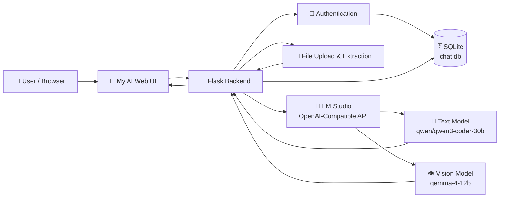
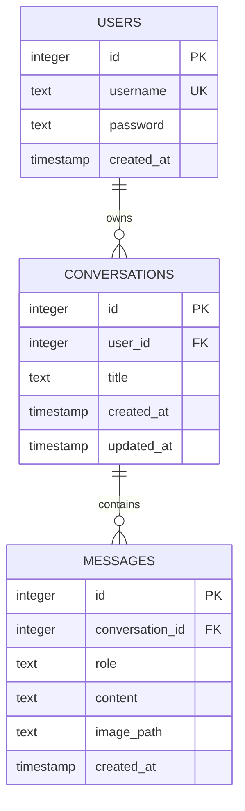
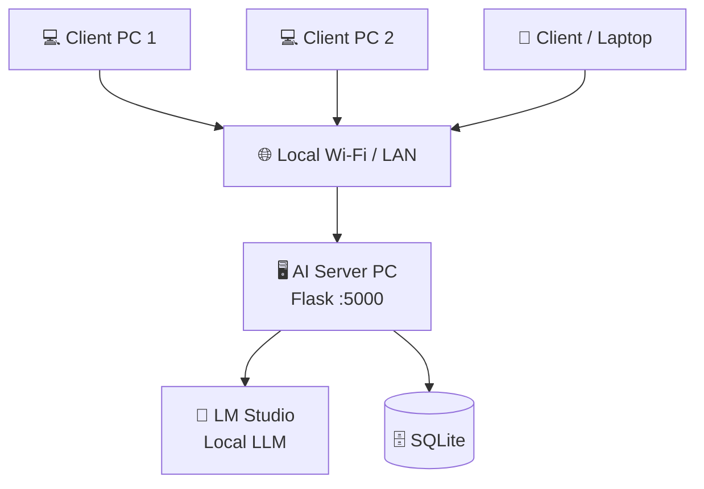
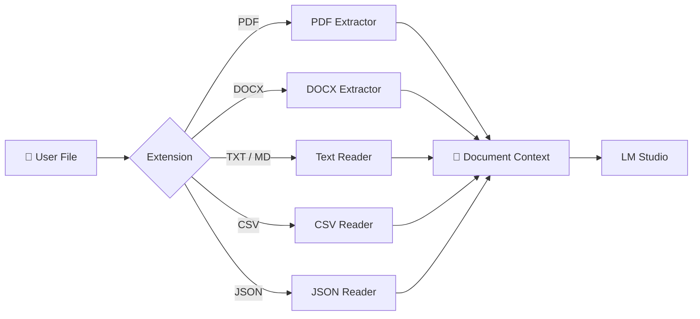

# ✨ My AI — Local Multimodal AI Assistant

<p align="center">
  
</p>

<p align="center">
  <b>A private, local-first AI chat application powered by Flask + LM Studio.</b><br>
  Chat with text, analyze images, upload documents, and keep separate conversations for multiple users.
</p>

<p align="center">
  
  
  
  
  
</p>

---

## 🧠 What is My AI?

**My AI** is a self-hosted AI assistant designed to run on your own machine or private LAN.

The backend is built with **Flask** and communicates with a locally running **LM Studio OpenAI-compatible API**. The application supports a normal text model, a vision model, document extraction, user authentication, conversation history, and SQLite persistence.

The current backend is configured to connect to LM Studio at:

```text
http://127.0.0.1:1234/v1
```

The application exposes the Flask server on:

```text
0.0.0.0:5000
```

So it can be adapted for access from other machines on the same local network.

---

# 🎨 UI Preview

The interface follows a modern dark AI-chat layout:

- 🌑 Dark, distraction-free workspace
- ✨ **My AI** branding
- 🟢 Local AI status indicator
- 💬 Chat history sidebar
- ➕ New Chat button
- 🖼️ Multimodal image support
- 📎 Document/code attachment support
- ⌨️ Large AI chat composer
- 📱 Responsive-friendly layout
- 🧠 Local inference indicator

<p align="center">
  
</p>

---

# 🚀 Core Features

| Feature | Description |
|---|---|
| 💬 **AI Chat** | Send normal text prompts to the local LLM |
| 👁️ **Vision AI** | Send an image with a prompt for visual analysis |
| 📄 **PDF Support** | Extract text from PDF documents |
| 📝 **DOCX Support** | Extract paragraphs and table contents |
| 📃 **TXT / Markdown** | Read `.txt` and `.md` files |
| 📊 **CSV Support** | Convert CSV rows into model-readable text |
| 🧾 **JSON Support** | Parse and format JSON documents |
| 👤 **Multi-user Login** | Register and authenticate users |
| 🔐 **Password Hashing** | Passwords are stored using Werkzeug password hashing |
| 💾 **Conversation History** | Store chats separately for each user |
| 🗑️ **Chat Deletion** | Delete individual conversations |
| 🏷️ **Automatic Titles** | New conversations receive a title based on the first request |
| 🧠 **Document-grounded Chat** | Uploaded document content is provided to the model as the primary source |
| 🖥️ **Local Inference** | Model inference can remain on your own machine through LM Studio |

---

# 🏗️ Architecture



---

# 🔄 Request Flow

## 💬 Normal Text Chat

```text
User
  │
  ▼
My AI Web UI
  │
  ▼
Flask /chat endpoint
  │
  ▼
Validate conversation
  │
  ▼
Load previous messages
  │
  ▼
Select TEXT_MODEL
  │
  ▼
LM Studio
  │
  ▼
Local Text LLM
  │
  ▼
AI Response
  │
  ▼
Save response in SQLite
  │
  ▼
Display in browser
```

---

## 👁️ Image Understanding

```text
User uploads/selects image
          │
          ▼
      My AI UI
          │
          ▼
       /chat
          │
          ▼
    Image + Prompt
          │
          ▼
    VISION_MODEL
          │
          ▼
       LM Studio
          │
          ▼
     Vision LLM
          │
          ▼
    Image Analysis
          │
          ▼
      Browser UI
```

---

## 📄 Document Chat

```text
Upload PDF / DOCX / TXT / MD / CSV / JSON
                    │
                    ▼
             Flask /api/upload
                    │
                    ▼
             File validation
                    │
                    ▼
             Text extraction
                    │
                    ▼
           Document content
                    │
                    ▼
              /chat endpoint
                    │
                    ▼
          Text model via LM Studio
                    │
                    ▼
             Grounded answer
```

---

# 📂 Supported Documents

The backend currently allows:

```text
.pdf
.txt
.md
.csv
.json
.docx
```

Maximum upload size:

```text
20 MB
```

The extracted document content is capped at:

```text
100,000 characters
```

This prevents very large documents from being sent directly to the model.

---

# 🧩 Technology Stack

### Frontend

```text
HTML
CSS
JavaScript
Markdown rendering
```

### Backend

```text
Python
Flask
SQLite
Werkzeug
```

### AI

```text
LM Studio
OpenAI-compatible API
Local LLM inference
Text model
Vision model
```

### Document Processing

```text
pypdf
python-docx
csv
json
```

---

# 🤖 Model Configuration

The backend currently separates text and vision workloads.

### Text model

```python
TEXT_MODEL = "qwen/qwen3-coder-30b"
```

### Vision model

```python
VISION_MODEL = "gemma-4-12b"
```

### LM Studio API

```python
client = OpenAI(
    base_url="http://127.0.0.1:1234/v1",
    api_key="lm-studio"
)
```

> **Important:** Model IDs must match the model identifiers exposed by your LM Studio installation.

---

# 🔐 Authentication

My AI includes a simple user authentication system.

### Registration

```text
Username
    │
    ▼
Password validation
    │
    ▼
Password hashing
    │
    ▼
SQLite users table
    │
    ▼
Session created
```

### Login

```text
Username + Password
        │
        ▼
SQLite user lookup
        │
        ▼
Password hash verification
        │
        ▼
Flask session
        │
        ▼
Access My AI
```

Passwords are not stored as plain text; the application uses Werkzeug's password hashing functions.

---

# 🗄️ Database Design

The application uses SQLite.



---

# 🌐 API Endpoints

| Method | Endpoint | Purpose |
|---|---|---|
| `GET/POST` | `/register` | Register a user |
| `GET/POST` | `/login` | Authenticate a user |
| `GET` | `/logout` | Clear session |
| `GET` | `/` | Main AI interface |
| `GET` | `/api/conversations` | Get current user's conversations |
| `POST` | `/api/conversations` | Create a conversation |
| `DELETE` | `/api/conversations/<id>` | Delete a conversation |
| `POST` | `/api/upload` | Upload and extract a document |
| `GET` | `/api/conversations/<id>` | Get messages |
| `POST` | `/chat` | Send text/image/document request |

---

# 📁 Suggested Project Structure

```text
my-ai/
│
├── app.py
├── chat.db
├── requirements.txt
│
├── templates/
│   ├── index.html
│   ├── login.html
│   └── register.html
│
├── static/
│   ├── css/
│   │   └── style.css
│   ├── js/
│   │   └── app.js
│   └── images/
│
├── uploads/
│
└── README.md
```

---

# ⚙️ Installation

## 1. Clone the project

```bash
git clone <your-repository-url>
cd my-ai
```

## 2. Create a virtual environment

### Linux / Ubuntu

```bash
python3 -m venv venv
source venv/bin/activate
```

### Windows

```powershell
python -m venv venv
venv\Scripts\activate
```

## 3. Install dependencies

```bash
pip install flask pypdf python-docx openai werkzeug
```

Or, if a `requirements.txt` file is available:

```bash
pip install -r requirements.txt
```

---

# 🧠 Configure LM Studio

1. Install and open **LM Studio**.
2. Download/load your required text model.
3. Download/load a compatible vision model.
4. Start the LM Studio local server.
5. Confirm that the OpenAI-compatible API is running on:

```text
http://127.0.0.1:1234/v1
```

6. Make sure the model IDs in `app.py` match the IDs shown by LM Studio.

---

# ▶️ Run My AI

```bash
python app.py
```

The Flask application listens on:

```text
http://0.0.0.0:5000
```

On the same machine, open:

```text
http://127.0.0.1:5000
```

For a LAN deployment, use the server PC's local IP:

```text
http://SERVER_IP:5000
```

Example:

```text
http://192.168.1.100:5000
```

---

# 🖥️ Local Network Architecture

This project can be used as a private AI server for multiple computers on the same LAN.



This allows the browser clients to connect to the Flask server while the model inference stays on the machine running LM Studio.

---

# 📦 File Upload Pipeline



---

# 🛡️ Security Notes

For production or internet-facing deployment, update the default configuration.

### Change the Flask secret key

The application currently falls back to:

```python
"change-this-secret-key"
```

Set a strong environment variable instead:

```bash
export FLASK_SECRET_KEY="your-long-random-secret"
```

### Additional production recommendations

- Use HTTPS.
- Do not expose LM Studio directly to the public internet.
- Put Flask behind a production WSGI server.
- Add CSRF protection.
- Add rate limiting.
- Restrict upload MIME types.
- Scan uploaded files when required.
- Disable Flask debug mode in production.
- Use a stronger database setup for larger deployments.

---

# ⚡ Performance Considerations

Local inference performance depends heavily on:

```text
GPU VRAM
System RAM
Model size
Quantization
Context length
Batch size
Prompt length
Concurrent users
```

For multiple users, the Flask application can act as the web/API layer while LM Studio performs model inference.

---

# 🧪 Example Prompts

### General AI

```text
Explain how TCP works in simple words.
```

### Coding

```text
Write a Python program to implement binary search.
```

### Image analysis

```text
What objects are visible in this image?
```

### Document analysis

```text
Summarize this document and list the important points.
```

### Document question answering

```text
According to the uploaded document, what is the main objective?
```

---

# 🖼️ UI Design Concept

```text
┌─────────────────────────────────────────────────────────────────────┐
│ ✨ My AI                         🟢 Multimodel Support   +          │
├───────────────┬─────────────────────────────────────────────────────┤
│               │                                                     │
│  + New chat   │                    AI Conversation                  │
│               │                                                     │
│  CHAT HISTORY │              ┌──────────────────────┐               │
│               │              │      User Message    │               │
│  • what is    │              └──────────────────────┘               │
│  • create     │                                                     │
│  • GATE       │                    🖼️ Image                         │
│  • networking │                                                     │
│               │              AI explanation...                     │
│               │                                                     │
│               │                                                     │
│ Alex          │  📷  📎  Message My AI...                   ↑      │
│ ● Local AI    │                                                     │
└───────────────┴─────────────────────────────────────────────────────┘
```

---

# 🧭 Project Flow

```text
                    ┌───────────────────┐
                    │       USER        │
                    └─────────┬─────────┘
                              │
                              ▼
                    ┌───────────────────┐
                    │    My AI UI       │
                    └─────────┬─────────┘
                              │
             ┌────────────────┼────────────────┐
             │                │                │
             ▼                ▼                ▼
        💬 Text          👁️ Image          📄 Document
             │                │                │
             ▼                ▼                ▼
        Text Model       Vision Model     Text Extraction
             │                │                │
             └────────────────┼────────────────┘
                              ▼
                    ┌───────────────────┐
                    │    LM Studio      │
                    │   Local Inference │
                    └─────────┬─────────┘
                              │
                              ▼
                    ┌───────────────────┐
                    │   AI Response     │
                    └─────────┬─────────┘
                              │
                              ▼
                    ┌───────────────────┐
                    │ SQLite + Browser  │
                    └───────────────────┘
```

---

# 🌟 Why Local AI?

Running the model locally can provide:

- 🔒 Greater control over data
- 📴 Offline/private inference capability when the models are already available
- ⚡ Low-latency access on a local network
- 🧩 Full control over the application stack
- 💻 Custom integration with local applications
- 🏠 A private AI server for a home, lab, or organization

---

# 🔮 Possible Future Improvements

```text
☐ Streaming token responses
☐ Voice input
☐ Text-to-speech
☐ RAG with vector database
☐ Multiple model selection
☐ Admin dashboard
☐ User usage statistics
☐ Conversation export
☐ Dark/light themes
☐ Drag-and-drop files
☐ Better mobile UI
☐ WebSocket-based real-time chat
☐ GPU performance monitoring
☐ Multi-node inference
```

---

# 📜 Current Backend Highlights

The backend already provides:

```text
Flask application
        +
User authentication
        +
SQLite persistence
        +
Conversation management
        +
Document extraction
        +
Text inference
        +
Vision inference
        +
LAN-ready host binding
```

The uploaded backend defines separate text and vision model configuration, supports PDF/TXT/MD/CSV/JSON/DOCX uploads, stores users/conversations/messages in SQLite, and exposes the Flask service on `0.0.0.0:5000`. 

---

# ❤️ Project

**My AI — Local Multimodal AI Assistant**

> A clean interface for bringing powerful AI models into a private local environment.

<p align="center">
  <b>💬 Chat • 👁️ Vision • 📄 Documents • 🔐 Private • 🧠 Local AI</b>
</p>

<p align="center">
  Built with Python + Flask + LM Studio + SQLite
</p>
